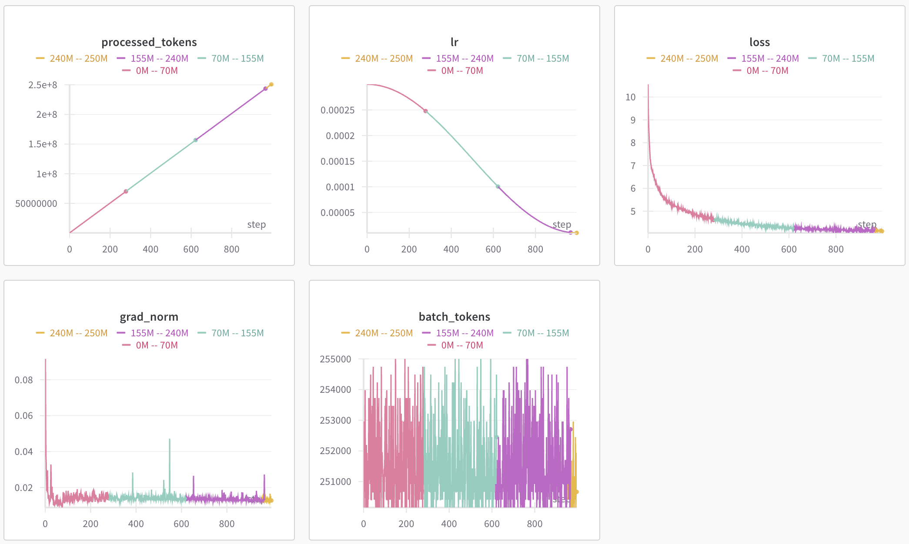

## Pretraining LLaMA from Scratch

This project implements a transformer model with ~200M parameters, inspired by the original [LLaMA](https://arxiv.org/abs/2302.13971) paper.

The architecture includes modern improvements:
- RoPE (Rotary Position Embeddings)
- SwiGLU
- RMSNorm
- Pre-normalization

The model was trained from scratch on one-eighth of the [OpenWebText](https://skylion007.github.io/OpenWebTextCorpus/) dataset, with a total of **250M tokens** processed.

---

## Training Curves

Training was performed on a single GPU in Google Colab with a time limit of 4 hours. Therefore, each color on the graphs represents a new session start with checkpoint loading and continued training from the saved checkpoints on Google Drive.

  

---

## Repository Structure

- `model.py` — model architecture classes
- `train_loop.py` — training loop:
  - stopping by number of processed tokens
  - gradient accumulation
  - mixed precision (`torch.autocast`)
  - checkpoint saving and loading
- `data_preprocess.py` — data preparation:
  - merges lines from a batch into a single string
  - splits the resulting string into sequences of maximum length without padding
  - creates `DataLoader`
- `drive_managment.py` — Google Drive trash cleanup from Google Colab

---

## Training Features

- Use of `torch.autocast` to reduce memory usage
- FlashAttention to speed up attention
- Training tracker — [Weights & Biases](https://wandb.ai)
- All sessions were launched on Google Colab with progress saved

---

## Plans

- Increase model context length using [Position Interpolation](https://arxiv.org/pdf/2306.15595)
- Evaluation on the [tinyMMLU](https://huggingface.co/datasets/tinyBenchmarks/tinyMMLU) benchmark
